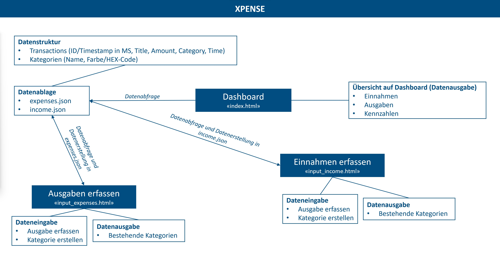

# XPENSE - PRO2_DBM20VZ - Dominik Werder

Todo:
- Erklärungen von Überlegungen und Struktur des Codes in Form von Kommentaren und Funktionsbeschreibungen im Code.
- Eine Projektbeschreibung mit Überlegungen und Entstehungsdetails mit Projektidee und Diagramme.
- Anleitung oder Walkthrough wie das Projekt installiert und benutzt wird, welche Funktionen vorhanden sind und wie diese eingesetzt werden.

## Projektbeschreibung
### Über XPENSE
XPENSE ist ein Programm zur Übersicht der eigenen Einnahmen und Ausgaben, also ein kleines Buchhaltungsprogramm.
Durch das Internet und Kartenzahlungen gibt jede Person sein Geld oft unbewusst aus. XPENSE soll hier Abhilfe schaffen und vor allem das Ausgeben von Geld bewusster gestalten. Es können einzelne Einnahmen und Ausgaben (mit einigen Details) erfasst werden, welche dann in einer Übersicht dargestellt werden. Somit soll das eigene Vermögen immer im Überblick gehalten werden können.
 

### Überlegungen und Entstehungsdetails
Das Programm XPENSE soll helfen, Ausgaben bewusster zu tätigen. Zudem sollen die Einnahmen erfasst werden können, um gut Statistik führen zu können. Die ersten Überlegungen waren die Anforderungen an das System:
* Ausgaben/Einnahmen erfassen
* Ausgabe/Einnahmen nach Kategorie einordenen
* Neue Kategorien erfassen
* Dashboardübersicht
* Verschiedene Kennzahlen

Anhand dieser Anforderungen wurde ein grober Systemaufbau erstellt. Der angepasste und digitalisierte Aufbau befindet sich im nächsten Abschnitt. Im Enstehungsprozess kamen weitere Funktionen hinzu. Die Kategorien können nun mit einer Farbe versehen werden, was zu einer besseren Übersichtlichkeit führt. Zudem werden den Transaktionen automatisch die aktuelle Zeit der Eintragung zugeordnet, was die Eingabe erleichtert. Zudem war nur eine Eingabe-Seite geplant. Ebenfalls wegen der besseren Übersicht und einfacheren Handhabung wurden daraus zwei Seite ("Einnahme erfassen" und "Ausgabe erfassen"). 

### Übersichtsdiagramm XPENSE

## Anleitung XPENSE
Die Bedienung von XPENSE ist übersichtlich. Zur Hilfe kann das Diagramm aus vorherigem Absatz beigezogen werden.
Das Programm besteht aus folgenden Seiten:

### Dashboard
Im Dashboard befindet sich eine Übersicht über die getätigten Transaktionen. Zudem eine Statistik, mit verschiedenen, relevanten Kennzahlen. Es können nur Werte und Informationen abgelesen werden, aber keine Eingaben getätigt werden.

### Ausgaben/Einnahmen erfassen
Folgende Bedienungsmöglichkeiten bieten die Seiten "Ausgaben erfassen" und "Einnahmen erfassen":
* Neue Ausgabe/Einnahme erfassen
  * Ein Titel und der Betrag der Ausgabe/Einnahme soll eingegeben werden
  * Zudem soll eine Kategorie ausgewählt werden (ACHTUNG: Zuerst muss eine Kategorie erstellt werden)
  * Nach betätigen des "erfassen"-Button wird die Transaktion eingetragen und im Dashboard angezeigt

* Kategorie erstellen
  * Es muss ein Namen für eine Kategorie, welche neu erstellt werden soll, erfasst werden
  * Zudem muss über den "Color Picker", eine Farbe, welche die Kategorie haben soll, ausgewählt werden
  * Nach betätigen des "erstellen"-Button wird die Kategorie eingetragen und kann nun genutzt werden
  * ACHTUNG: Kategorien sind für Einnahmen und Ausgaben nicht identisch

* Bestehende Kategorien
  * Hier befinden sich die bereits erstellten Kategorien, welche als Hilfe (beim erstellen einer neue Kategorie), abgebildet werden